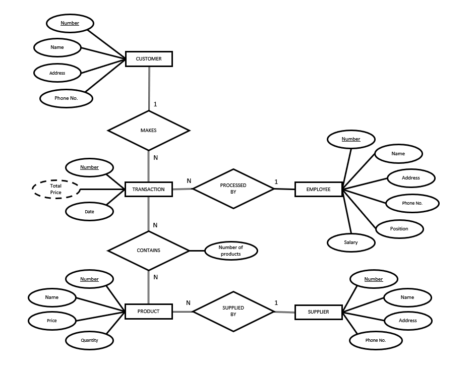
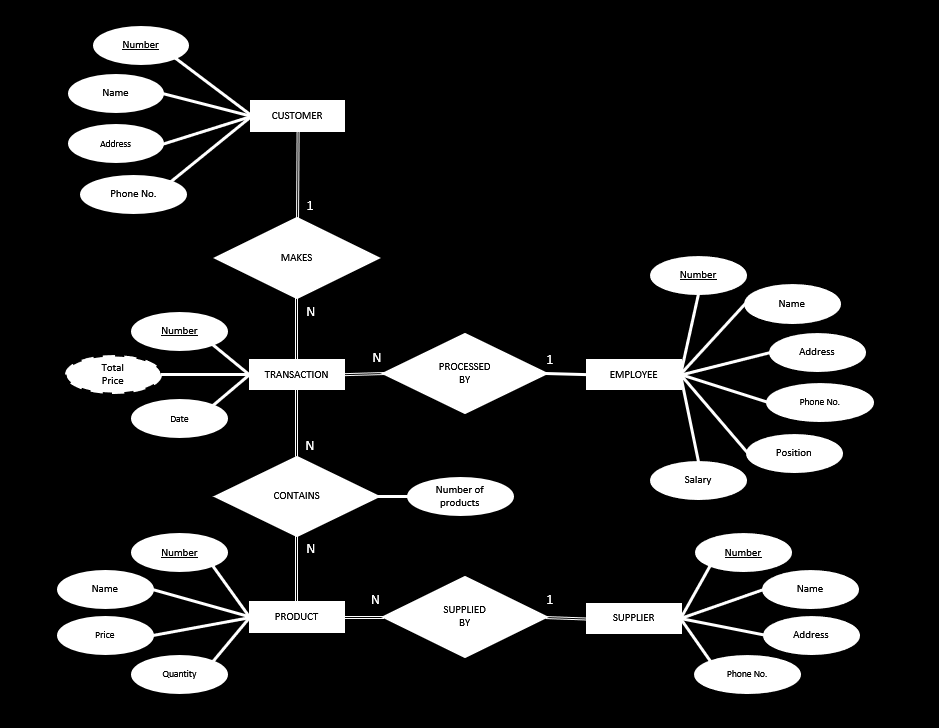
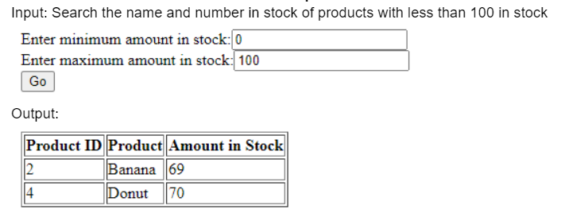

# Grocery Store Inventory System

### Stephen Shuecraft/Zhen Ze Ong/Ze Sen Tang/Kashia Ly

[][grocerylight]
[][grocerydark]

This was our final group project for a Data Modeling & Application Project class. We designed and created a simple database for an imaginary grocery store using MySQL Workbench. We then made a local HTML webpage that allowed a user to retrieve and update data. The database contains sample employee, customer, product, supplier, and transaction data. We then made queries and updates on the database to test its functionality.

[grocerylight]: https://github.com/aJustinOng/GroceryStore#gh-light-mode-only
[grocerydark]: https://github.com/aJustinOng/GroceryStore#gh-dark-mode-only
